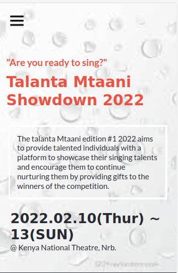
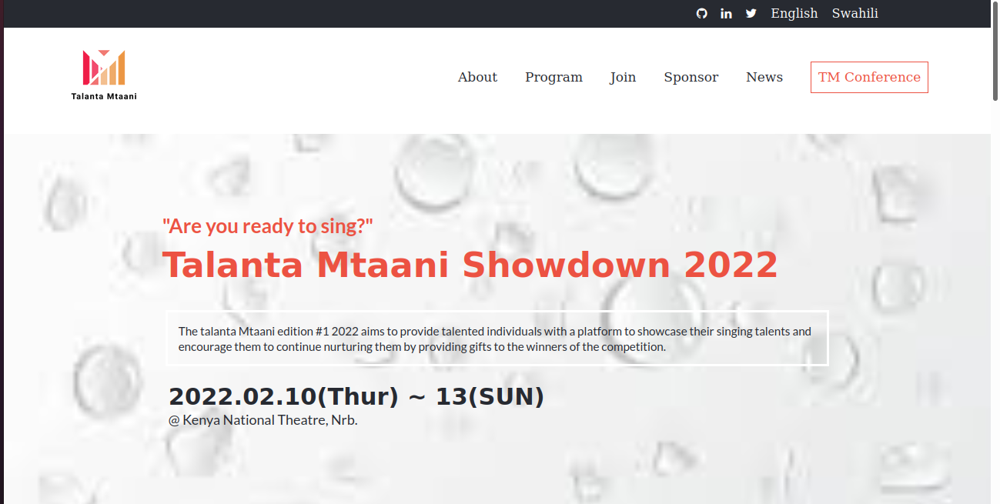
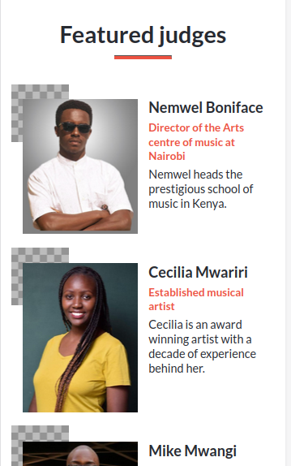
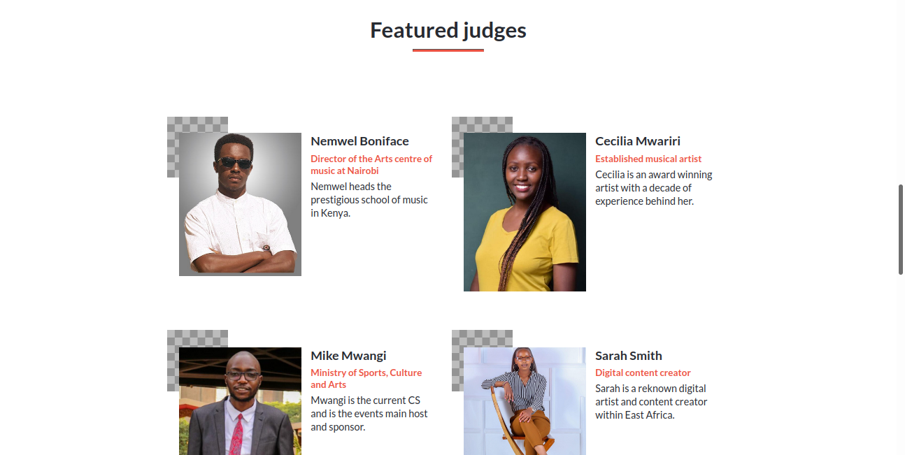

# Talanta Mtaani

> "Talanta Mtaani" is a mock project I have done for my Microverse portal module. The project is about a music competition that aims to help the underprevileged young people to showcase their talents. With the hope that they will get a platform to sign deals and start producing professional music.
> The project consists of two pages:
- Home page
- About page
> "Talanta Mtaani" is a swahili word which can be roughly translated to "Talent In the area".

This project is proof of my understanding of HTML-5, CSS3, Javascript DOM manipulation, Github flow, CSS animations and transitions, how to document my work professionally.
- The design if from [Cindy Shin](https://www.behance.net/adagio07) The design its self can be viewed [here](https://www.behance.net/gallery/29845175/CC-Global-Summit-2015)
- The logo I used is from [this](https://hatchful.shopify.com/onboarding/brand-values) website.

## Built With

- HTML-5
- CSS3
- Javacript
- Linters
- Google font awesome icons

## Live Demo
Live site URL to portfolio
[Live Demo Link](https://nemwel-boniface.github.io/Talanta-Mtaani/)

## Getting Started

- To get a local copy up and running follow these simple example steps.

### Prerequisites

- You only need a browser to run the html file in.

### Setup

- Create a new folder to store the files in.

### Install

- Open your command prompt or terminal and run.
> git clone git@github.com:Nemwel-Boniface/personal-portfolio.git .

### Run tests

- To run tests run :
> npx hint .
> npx stylelint "**/*.{css,scss}"
> npx eslint .

### Deployment

- Project is deployed using
> git push <branch_name>

## Authors

👤 **Author1**

- GitHub: [@Nemwel-Boniface ](https://github.com/Nemwel-Boniface)
- Twitter: [@nemwel_bonie](https://twitter.com/nemwel_bonie)
- LinkedIn: [Nemwel](https://www.linkedin.com/in/nemwel-nyandoro-aa1b2620b/)

## 🤝 Contributing

Contributions, issues, and feature requests are welcome!

Feel free to check the [issues page](https://github.com/Nemwel-Boniface/Talanta-Mtaani/issues).

## Show your support

Give a ⭐️ if you like this project!

## Acknowledgments
Major thanks to
- [Sa Nene](https://www.instagram.com/iamsamuelmunene/)
- [Cecilia Mwariri](https://www.instagram.com/cecilia_mwariri/)
- [Virginia Wanjiru](https://www.instagram.com/v.e.e_wanjiru_/)

## 📝 License

This project is [MIT](./MIT.md) licensed.